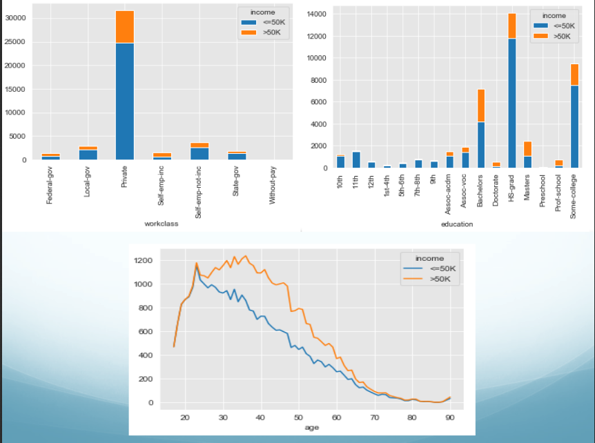
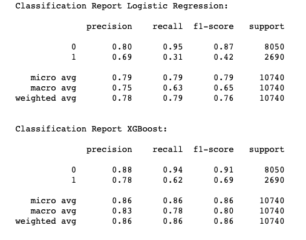

# Applying Supervised Machine Learning Models

## Census Income Data Set

The Census Income is a popular data set used for classification in Machine Learning; it's used to classify a person's income in two groups based on census data. The groups are people who earn more than 50,000/year, and those who earn less than 50,000/year. The data set contains 14 attributes and 48,842 instances.

### Question
Does a person make more than 50K a year?


### Insights




### Classification Models

* Logistic Regression
* XGBoost

##### Feature Importance XGBoost


##### Model Comparison before balancing




##### Logistic Regresion - Balanced


##### XGBoost - Balanced


#### Interpretation

* We can predict and classify income with the given data.  
* The private sector is were most people work with higher salaries. 
* Higher education means higher salaries. 
* The peak income for those earning more than 50K is in between early 20’s and late 30’s. 


```python

```
